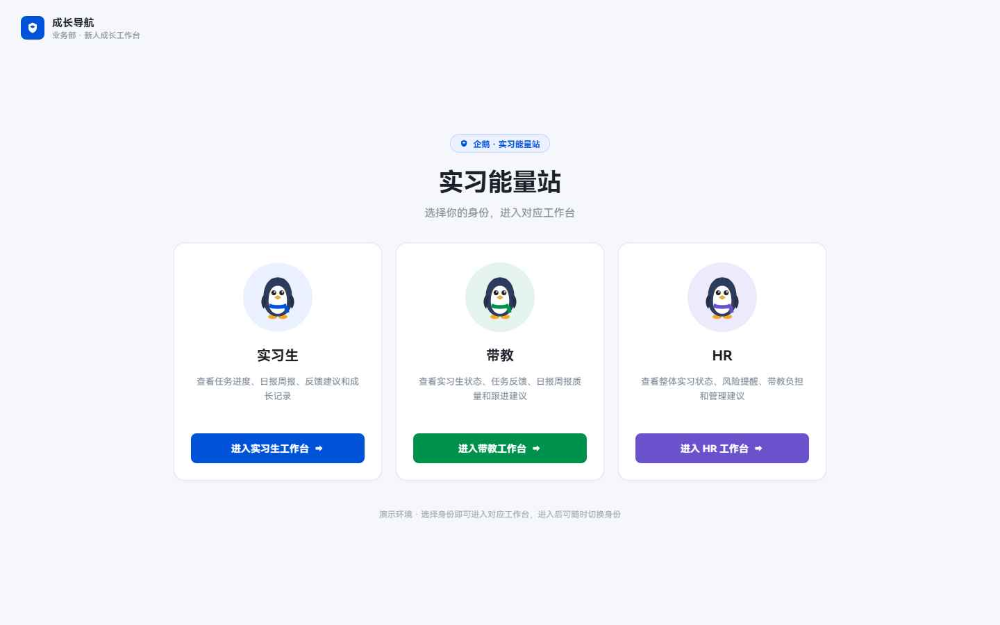
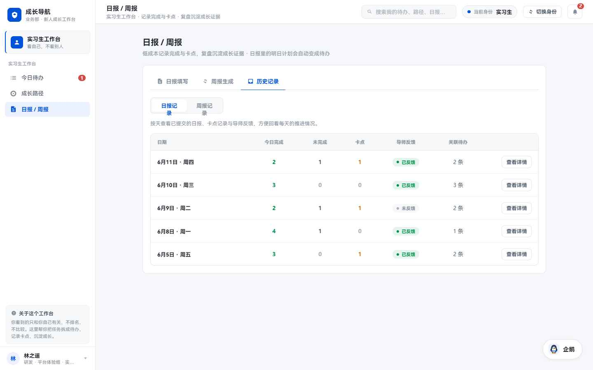
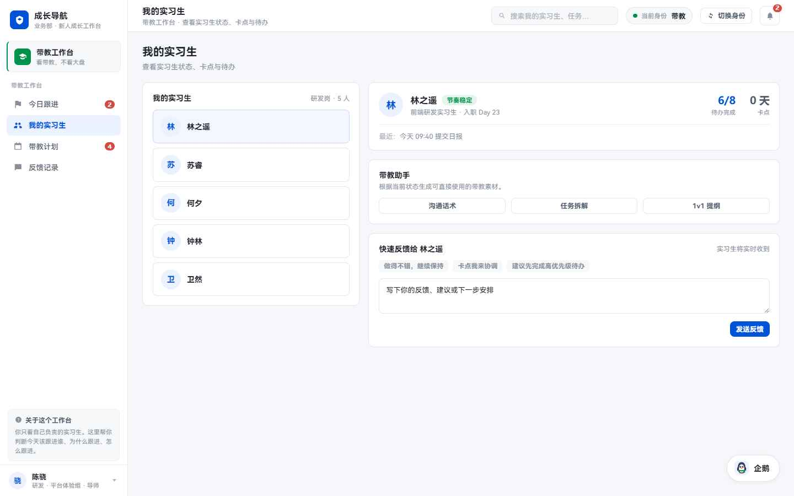
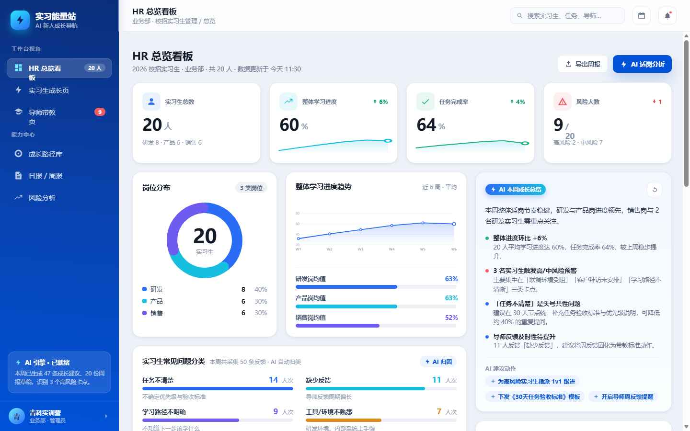
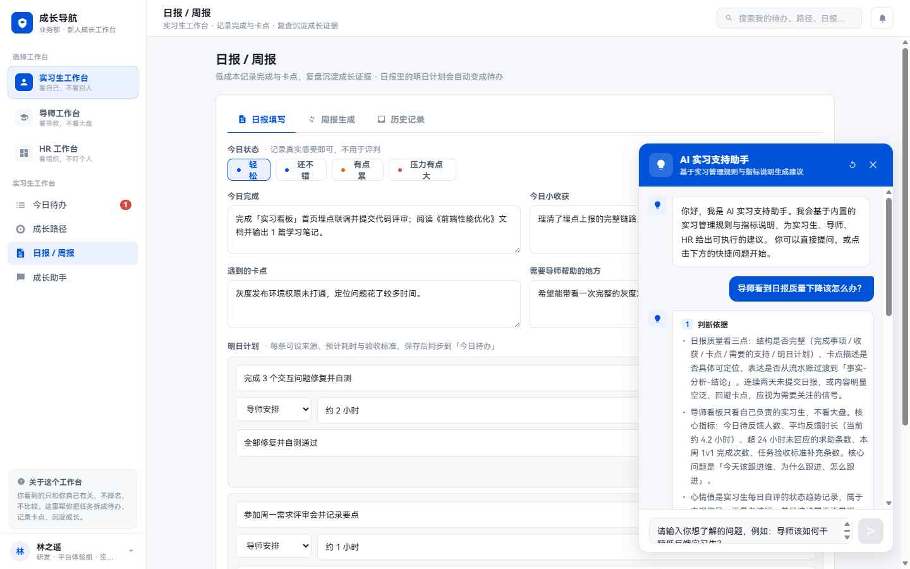
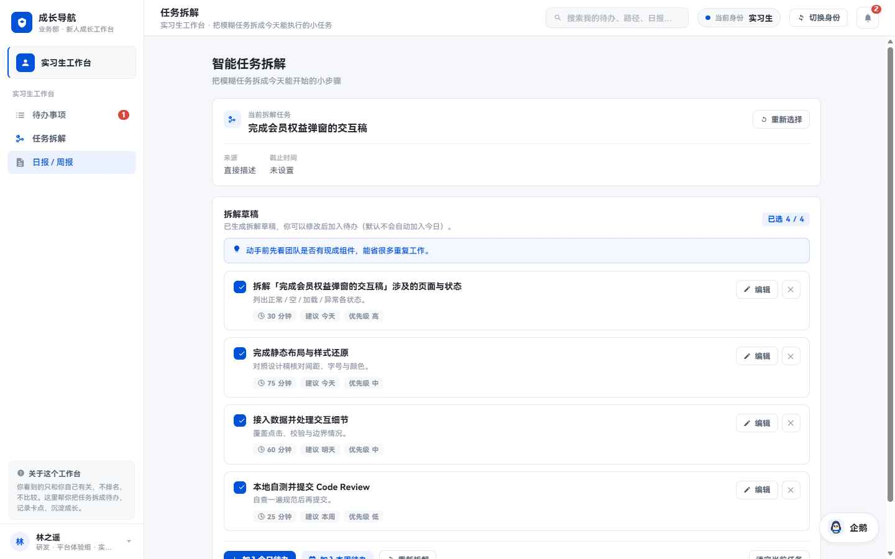
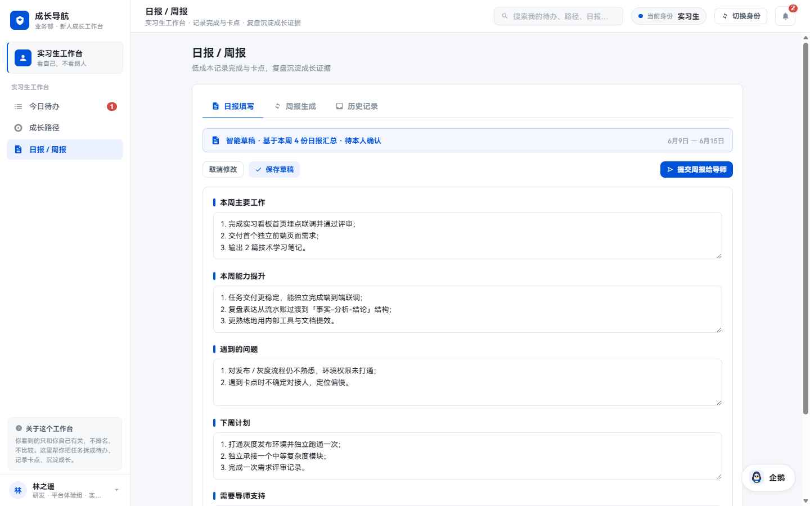

# 实习能量站 · 业务部新人成长导航智能看板

> 🌐 **在线体验**：https://intern-ai-hr-d9g2t0q9c36bb1a6a-1443398117.ap-shanghai.app.tcloudbase.com/
> 📖 **English**：[README.en.md](README.en.md)
> （部署在腾讯云 CloudBase 云托管，前端 + 后端 API 同一服务）

面向「实习生 / 带教 / HR」三种身份的新人成长工作台，内置一个名为 **企鹅** 的规则库 RAG 助手（基于团队规则库的检索增强问答，接入 DeepSeek）。

技术栈：**Vite + React 18**（前端）+ **Node / Express**（后端）。**一个 Node 进程同时托管前端静态页面与 `/api` 接口**，所以一份部署即带 API。

---

## 在线访问

- 网页：上方在线体验链接，选身份进入工作台，右下角「企鹅」即 RAG 助手。
- 健康自检：链接后加 `/api/health`，返回 `{"ok":true,"hasKey":true,"model":"deepseek-chat"}` 即表示后端正常、Key 已加载。
- 免费档说明：长时间无人访问会休眠，首次打开需等约 30–60 秒唤醒，之后正常。

---

## 截图

**身份选择入口**

> 实习生 / 带教 / HR 三种角色分卡进入各自的成长工作台。

**实习生工作台**

> 日报 / 周报历史，按天汇总完成、卡点与导师反馈；右下角为「企鹅」问答助手入口。

**带教工作台**

> 实习生列表 + 详情 + 带教助手（沟通话术 / 任务拆解 / 1v1 提纲）+ 快速反馈。

**HR 总览看板**

> KPI 卡片、岗位分布与学习进度图表、AI 本周成长总结、常见问题自动分类。

**企鹅 · 规则库问答（RAG）**

> 只基于团队规则库作答，并在回答旁标注参考了哪些规则。

**智能任务拆解**

> 把模糊任务自动拆成带时长、建议时间与优先级的可执行小步骤，可一键加入待办。

**周报智能草稿**

> 基于本周日报自动汇总成周报草稿，分段可编辑后保存或提交给导师。

---

## 本地开发

```bash
npm install
npm run dev:all      # 前端(5173) + 后端(8787) 一起起
```
打开 http://localhost:5173 。只跑 `npm run dev` 时 AI 功能走本地兜底、不报错。

本地以「生产模式」预览（和线上一致，单端口）：
```bash
npm run prod         # = vite build 后 node server/index.js，打开 http://localhost:8787
```

---

## 配置 DeepSeek Key

Key **只在后端读取**，前端代码与打包产物里都不会出现。

- **本地**：复制 `.env.example` 为 `.env.local`，填 `DEEPSEEK_API_KEY=sk-你的key`。`.env.local` 已被 `.gitignore` 忽略，不会提交。
- **线上（腾讯云）**：不写进代码，配置在云托管的**环境变量** `DEEPSEEK_API_KEY` 里。

---

## 企鹅 RAG（核心）

只基于团队规则库作答，不是普通聊天机器人。可信检索链路：

```
前端: 本地 searchKnowledgeBase 仅做「提前判断 no_match」
   → POST /api/penguin-chat { role, question }        // 前端只传 role+question
后端: matchedDocs = searchKnowledgeBase(question, role)  // 唯一可信来源，忽略前端传来的任何规则
   → 检索为空     → no_match，不调用 DeepSeek
   → 命中 2-3 条  → 仅用规则原文拼「只能基于规则回答」prompt → DeepSeek → kind:"api"
   → 调用失败/无Key → kind:"fallback"（基于规则的本地摘要）+ references
返回: { kind, answer, references:[{id,title,content}] }
```

- 规则库：`services/knowledgeBase.js`（**16 条规则**，前后端共用同一份，字段 `id/title/roles/tags/content`）。
- 三个工作台**相互独立**：各身份的对话历史分桶持久化，切到带教看不到实习生的提问，切回实习生又能看到自己的历史。
- 回答底部带**参考规则**标签，点击可展开规则原文，逐字比对。

---

## 部署到腾讯云 CloudBase 云托管

本项目已用此方式上线。云托管通过 **Docker 镜像**启动（项目根目录的 `Dockerfile` 已写好：构建前端 + 启动 Node 同时托管 `dist` 与 `/api`）。

### 部署 / 更新步骤

1. 生成干净的部署包（只含被 Git 跟踪的文件，自动排除 `node_modules` / `dist` / `.env.local`）：
   ```bash
   git archive --format=zip -o deploy.zip HEAD
   ```
2. 腾讯云控制台 → **云开发 CloudBase** → 选环境 → **云托管 → 服务管理 → 新建服务**。
3. 「新建本地代码部署」：
   - 代码包类型：**压缩包**，上传 `deploy.zip`
   - 服务名称：小写字母开头（如 `intern-ai-hr`）
   - **服务端口：`8787`**（必须与 `Dockerfile` 里的端口一致）
   - 构建设置：**Dockerfile**（默认，文件名 `Dockerfile`）
   - **环境变量：`DEEPSEEK_API_KEY` = 你的 Key**
4. 部署，等版本状态变「**正常**」→ 用云托管分配的**默认域名**访问（即上方在线体验链接）。

> 以后更新：改代码 → `git commit` → 重新 `git archive --format=zip -o deploy.zip HEAD` → 在云托管「新建版本」上传新 zip。
> 也可把部署来源改为连接 GitHub 仓库，实现 push 自动部署。

源码仓库：https://github.com/Alia0415/intern-energy-station

---

## 接口一览（server/index.js）

| 方法 | 路径 | 说明 |
|---|---|---|
| GET | `/api/health` | 健康检查 / Key 是否加载 |
| POST | `/api/penguin-chat` | 企鹅 RAG（后端检索规则库 → 只基于规则作答）|
| POST | `/api/ai/task-breakdown` | 任务拆解（DeepSeek）|
| POST | `/api/ai/weekly-report` | 周报生成（DeepSeek）|
| 其它 GET | `/*` | 返回打包后的 `index.html`（前端单页应用）|

---

## 目录结构（关键）

```
Dockerfile / .dockerignore   云托管容器构建（单镜像：构建前端 + 跑后端）
index.html                   入口（#root 主应用 + #penguin-root 企鹅覆盖层）
main.jsx / globals.js        入口与全局垫片（兼容原“全局脚本”写法）
app/components/intern/mentor/hr/report.jsx, data.js, styles.css   三角色工作台
penguin.jsx                  企鹅 RAG 面板（独立第二个 React 根）
services/
  knowledgeBase.js           16 条规则库 + searchKnowledgeBase + 兜底（前后端共用）
  aiService.js               任务拆解/周报封装（USE_MOCK_AI=false → 走后端 DeepSeek）
  storageService.js          localStorage 封装
server/index.js              后端：/api/* + 生产环境托管 dist 静态资源
.env.example                 环境变量模板（复制为 .env.local 填 Key；线上用云托管环境变量）
```

> 原型单文件 `实习能量站.html` 已保留作参考，Vite 不使用它。

---

## 安全须知

- `.env.local`（含 DeepSeek Key）已被忽略，不会进 Git、不会进部署镜像；线上 Key 只配在云托管环境变量。
- 打包产物 `dist/` 中不含 Key、不含 DeepSeek 地址；前端只调用同源 `/api/*`，从不直接访问模型 API。
